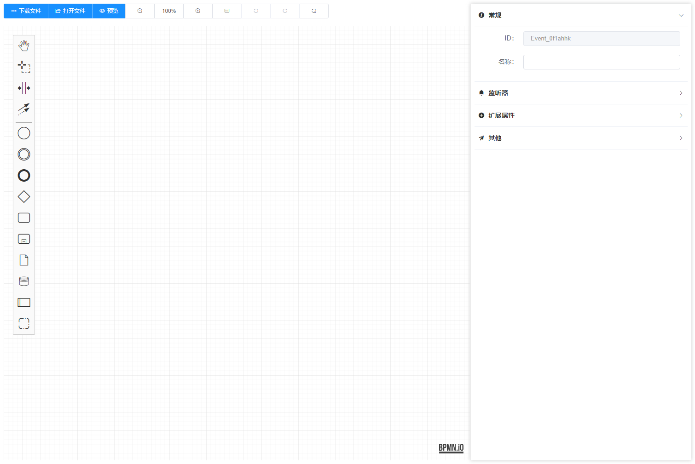
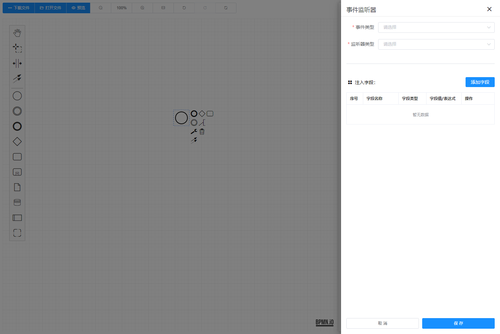
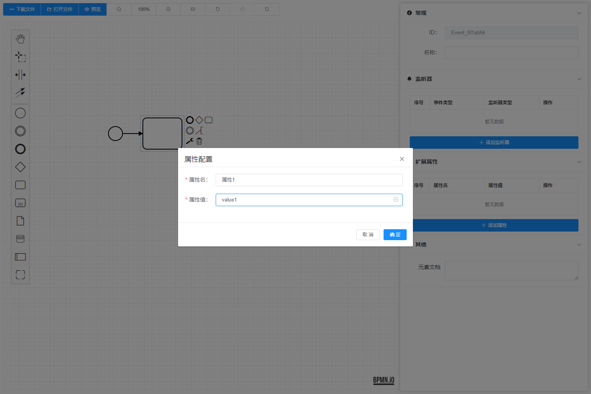
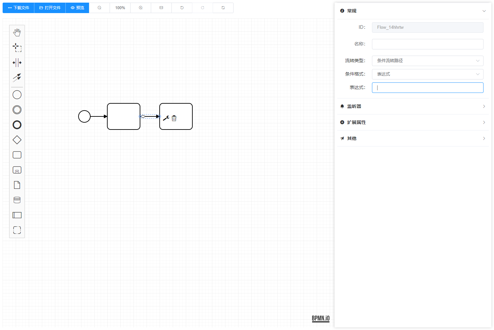
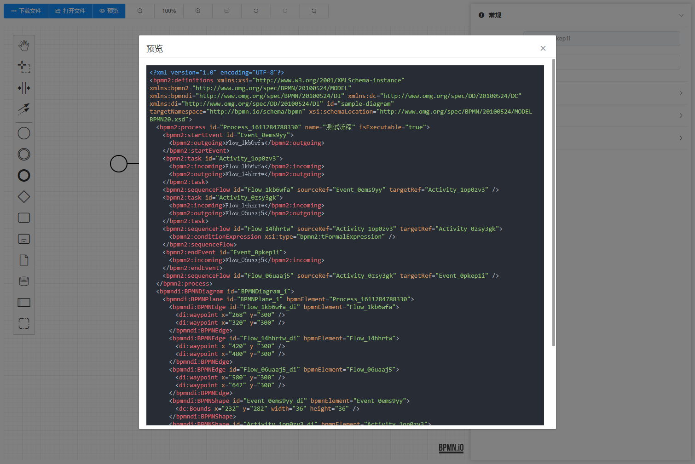

# Bpmn Process Designer

A process designer that depends on [bpmn.js](https://github.com/bpmn-io/bpmn-js)  ,  [Vue 2.x](https://github.com/vuejs/vue) and [ElementUI](https://github.com/ElemeFE/element). 

一个基于 `bpmn.js`，`Vue 2.x` 和 `ElementUI` 开发的流程设计器。


You can view and edit `BPMN 2.0` diagrams in the browser.

您可以使用它在浏览器上查看和编辑符合 `BPMN 2.0` 规范的流程文件。


For on line demo, please visit [MiyueFE Blog](https://miyuesc.github.io/process-designer/)

在线demo请访问 [MiyueFE Blog](https://miyuesc.github.io/process-designer/)


## 1. 安装依赖 Installation

```shell
npm install
// or yarn install
```

## 2. 运行 Quick Start

```shell
npm run demo
// or yarn run demo
```

## 3. 文档说明 Documentation

### 3.1 MyProcessDesigner

#### 3.1.1 Attributes

| Attribute             | Description                                               | Type        | Accepted Values                        | Default                                                      |
| --------------------- | --------------------------------------------------------- | ----------- | -------------------------------------- | ------------------------------------------------------------ |
| `value/v-model`       | 初始化流程对应的 `xml` 字符串                             | String      | -                                      | -                                                            |
| `translations`        | 翻译文件                                                  | Object      | -                                      | [zh.js](https://github.com/miyuesc/bpmn-process-designer/blob/main/package/process-designer/plugins/translate/zh.js) |
| `additionalModel`     | 自定义的附加模块                                          | Object[] / Object | -                                      | -                                                            |
| `moddleExtension`     | 自定义的扩展模块                                          | Object      | -                                      | -                                                            |
| `onlyCustomizeAddi`   | 仅使用开发时的自定义附加模块 | Boolean     | -                                      | `false`                                                      |
| `onlyCustomizeModdle` | 仅使用开发时的自定义扩展模块        | Boolean     | -                                      | `false`                                                      |
| `prefix`              | 流程引擎对应扩展属性前缀                         | String      | `camunda`, `activiti`, `flowable`      | `camunda`                                                    |
| `events`              | 需要使用的事件列表，可用事件见 [Bpmn.js 中文文档](https://github.com/miyuesc/blog/blob/master/bpmn/docs/Bpmn.js%20document.md#%E4%B8%89-%E4%BA%8B%E4%BB%B6) | Array       | -                                      | `[element.click]`                                            |
| `headerButtonSize`    | 头部按钮组的大小                          | String      | `"default", "medium", "small", "mini"` | `small`                                                      |

#### 3.1.2 Events

| Event Name      | Description                                                  | Callback Parameters              |
| --------------- | ------------------------------------------------------------ | -------------------------------- |
| `init-finished` | 流程实例等初始化完成之后                                     | `modeler`                        |
| `change`        | 流程发生可监听的改变时 ( `EventBus.on("commandStack.changed")`) | `XMLString`                      |
| `destroy`       | 组件准备销毁时，此时流程实例已经销毁                         | `modeler`                        |
| `BpmnEvents`    | Like `element.click`, will replace `.` to `-` (`ex: "element.click" => "element-click"` ). If you want to use an event, you must add the event name to the "`events`" parameter<br />传入参数 `events` 对应的事件发生时触发，会将 `events` 数组内部的事件名称中的 `.` 替换成 `-` 来适配 `vue` 的自定义监听事件。比如 `"element.click"` 会变成 `element-click` | `element, InternalEventInstance` |

#### 3.1.3 Methods

| Method Name             | Parameters                     | Description                              |
| ----------------------- | ------------------------------ | ---------------------------------------- |
| `downloadProcessAsXml`  | `name: string = "diagram"` | 下载文件为 `${name}.xml` 格式的文件  |
| `downloadProcessAsBpmn` | `name: string = "diagram"` | 下载文件为 `${name}.bpmn` 格式的文件 |
| `downloadProcessAsSvg`  | `name: string = "diagram"` | 下载文件为 `${name}.svg` 格式的文件  |
| `processRedo`           | -                              | 恢复上次操作 |
| `processUndo`           | -                              | 撤销本次操作 |
| `processZoomIn`         | `newZoom: number = 0.1`       | 按照指定倍率缩小视图（小数点后两位） |
| `processZoomOut`        | `newZoom: number = 1`         | 按照指定倍率放大视图（小数点后两位） |
| `processZoomTo` | `newZoom: number = 1` | 缩放视图到指定倍率 |
| `processReZoom`         | -                              | 重置缩放倍率并居中显示全部元素 |
| `processRestart`        | -                              | 重置所有编辑过程并清空画布 |

### 3.2 MyProcessPenal

#### 3.2.1 Attributes

| Attribute      | Description                 | Type   | Accepted Values                   | Default   |
| -------------- | --------------------------- | ------ | --------------------------------- | --------- |
| `bpmn-modeler` | 初始化生成的 `modeler` 实例 | Object | -                                 | -         |
| `prefix`       | 流程引擎对应扩展属性前缀    | String | `camunda`, `activiti`, `flowable` | `camunda` |
| `width`        | 侧边栏宽度                  | Number | -                                 | 480       |

## 4. 运行截图

### 4.1 初始界面



### 4.2 事件监听器



### 4.3 扩展属性



### 4.4 流转路径配置



### 4.5 预览



