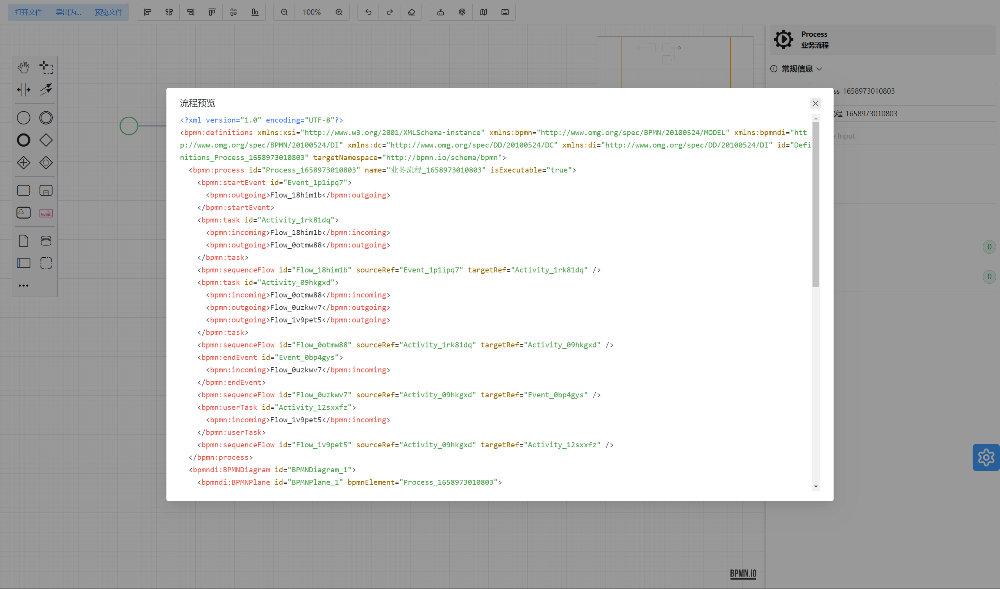
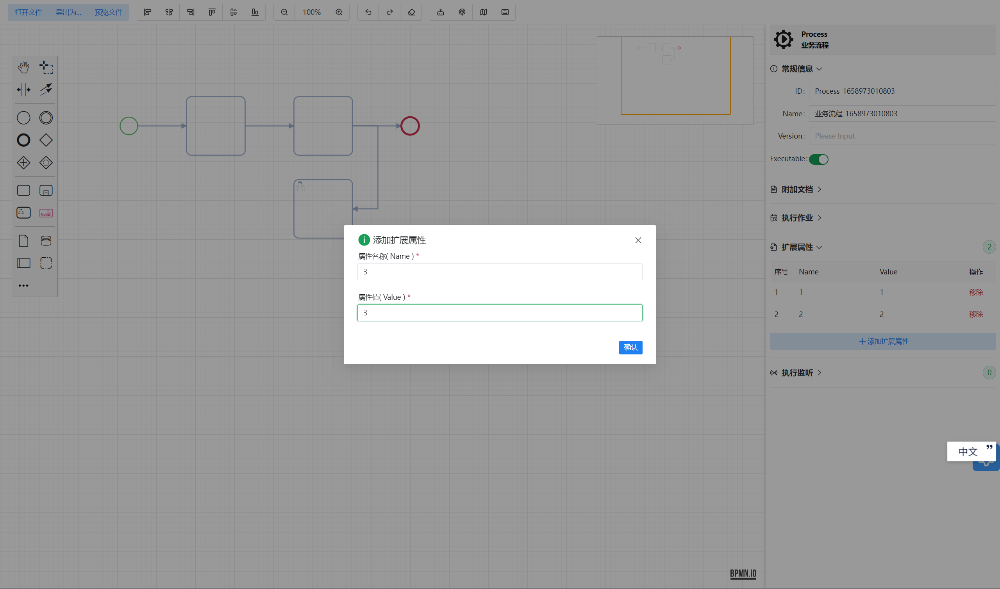
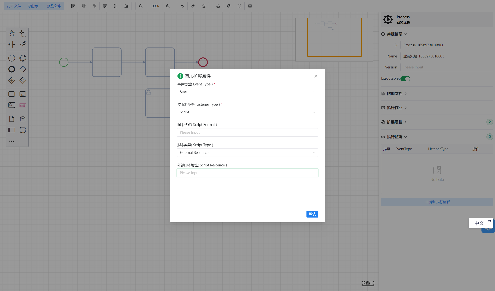
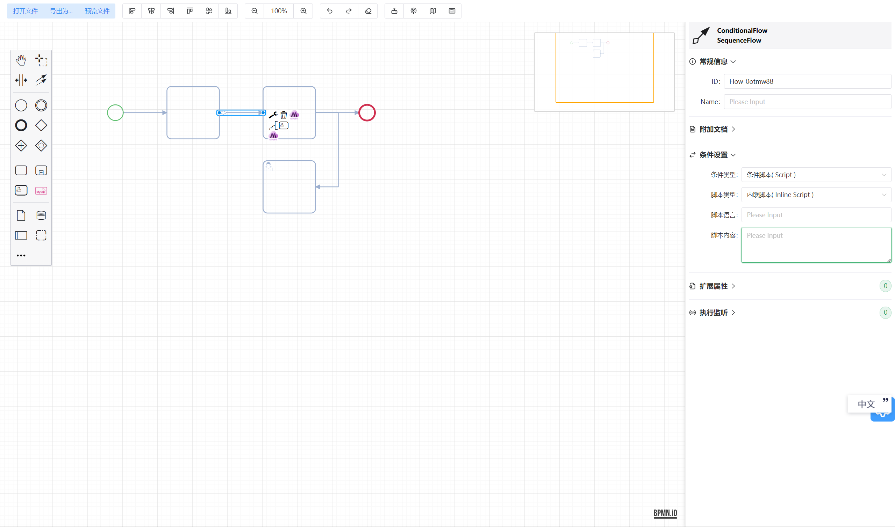
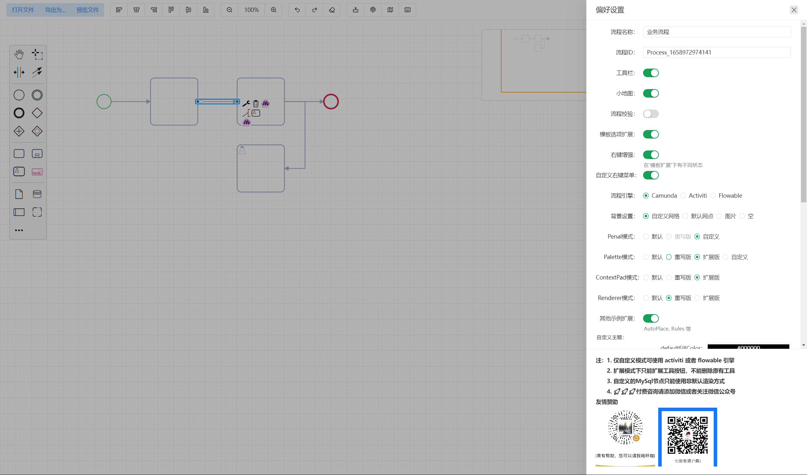
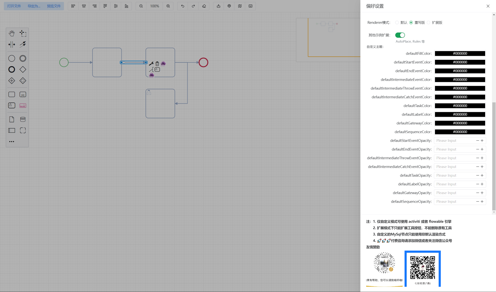

<p align="center">
  <a href="https://github.com/miyuesc/bpmn-process-designer">
   
  </a>
</p>

<h1 align="center">Bpmn Process Designer</h1>

<p align="center">


</p>

<p align="center">


</p>

<p align="center">
<a href="https://github.com/miyuesc/bpmn-process-designer/blob/v2/LICENSE"></a>
<a href="https://github.com/miyuesc/bpmn-process-designer/issues"></a>
<a href="https://github.com/miyuesc/bpmn-process-designer/pulls"></a>
</p>


<p align="center">
  <a href="https://miyuesc.github.io/process-designer-v2/">💻在线演示</a>
  ·
  <a href="https://github.com/miyuesc/bpmn-process-designer/issues/new">🐛报告 Bug</a>
</p>

## 项目简介

一个基于 `bpmn.js`，`Vue 2.x` 和 `ElementUI` 开发的 BPMN 2.0 流程设计器（网页版），您可以使用它在浏览器上查看和编辑符合 `BPMN 2.0` 规范的流程文件。

项目内置 activiti、flowable、camunda 三种流程引擎支持文件，并提供了常见功能自定义方法与演示代码。

但由于 bpmn.js 与实际业务的特殊性，本项目暂不支持直接使用与发布 NPM 依赖，建议根据实际需求参照 `App.vue` 进行使用和二次开发。

## TypeScript 支持

bpmn.js 的核心依赖 —— diagram.js，其核心模块已经支持 `TypeScript`，但是 `bpmn.js` 的 `tds` 仍然处于积压状态。所以在此情况下我编写了 `bpmn.js` 常用插件部分的 `ts` 声明，声明地址：[vite-vue-bpmn-process/types/declares](https://github.com/moon-studio/vite-vue-bpmn-process/tree/dev/types/declares)。

为支撑 `Vue3` 与 `vite` 开发模式，提供了该项目的 `Vue3` + `tsx` 实现：[vite-vue-bpmn-process](https://github.com/moon-studio/vite-vue-bpmn-process)

> 目前 bpmn-js 与 diagram-js 均已支持 typescript。

-----

> 2023年10月1日 更新
>
> 由于该项目目前依然存在一些未实现的功能和 Bug，但是修复起来比较麻烦，所以暂时停止维护。
>
> 目前已经新增了一个 **闭源** 的 Vue 3 + typescript 的项目，基本解决了所有已知 bug，并且增加了一些比较实用的功能。
>
> 已有功能：
>
> 1. 自适应网格背景（支持颜色、网格大小等设置）
> 2. 元素大小设置（初始化时可配置函数等）
> 3. 多元素组合创建
> 4. 自定义元素渲染（初始化时接收自定义元素渲染方法）
> 5. 自定义Palette
> 6. 工具栏
> 7. 兼容 camunda/activiti/flowable 部分属性配置的属性面板
> 8. 垂直泳道（有一点小问题）
> 9. 任务类节点外置label
> 10. 自动布局（无法识别泳道和子流程）
> 11. 美化 ContextPad
> 12. 扩展的自定义元素与属性
>
> 有需要的同学可以联系通过微信公众号联系我。
>
> 预览地址：[Vercel](https://vue-bpmn-process-designer.vercel.app/)、[GitHub Page](https://miyuesc.github.io/bpmn-designer/)


## 安装和使用

```bash
# 克隆仓库
git clone https://github.com/miyuesc/bpmn-process-designer.git -b v2

# 安装依赖
npm install

# 启动项目
npm run demo
```

## 开发指南

`bpmn.js` 的 **核心原理与常规改造** 可以参见我的文章：[Bpmn.js 进阶指南之原理分析与模块改造](https://juejin.cn/post/7117481147277246500)

**常用模块的开发及自定义**，参见 [Bpmn.js 全面进阶指南](https://juejin.cn/column/6964382482007490590)


## 功能说明

当前项目内主要包含五个组件：

- `Designer`：bpmn.js 的画布部分，所有组件的基础依赖组件
- `Toolbar`：顶部工具栏，依赖 `Designer` 组件实现 `xml` 文件的导入导出和预览，支持对齐、缩放、撤销恢复及其他第三方扩展模块开关
- `Panel`：自定义属性面板，包括基础属性、扩展属性、监听器、注释文档等配置；支持使用原生属性面板
- `ContextMenu`：自定义右键菜单，用于添加和更改节点类型
- `Settings`：全局偏好设置组件，主要用于控制演示项目的配置，实际项目中建议取消

另外包含一些 `bpmn.js` 的扩展：

- `additional-components`：扩展组件，可能依赖 `bpmn.js` 或者 `vue` 组件的一些原生 js 控制方法
- `additional-modules`：基于 `bpmn.js` 的原生模块进行扩展/重写的功能模块，只有 `bpmn.js` 关联。目前包含 `palette`、`contextMenu`、`renderer` 等部分，也是扩展大家进行二次开发的核心参考代码
- `bo-utils`：与元素 `businessObject` 相关的公共方法，主要涉及属性读取和更新；与后端使用的流程引擎绑定
- `bpmn-utils`：`bpmn.js` 相关的一些公共方法
- `moddle-extensions`：`BPMN 2.0` 规范格式的 `JSON Schema` 文档，包含基础的 `bpmn.json`，三大流程引擎文档与自定义元素文档

整个项目包含了 `store` 和 `EventBus` 两种消息传递方式：

- `store` 中主要存放当前 `Modeler` 实例与节点实例，以及项目配置项，在二次开发过程中可以采用别的数据共享方式取代
- `EventBus` 事件总线是该项目的 **核心消息传递方式**：因为 **节点实例不能被 `Vue` 进行响应式处理，影响性能且容易产生属性读取更新错误**，并且 **表单需要实时监听节点变化**，所以通过消息总线共享事件和数据是比较好的处理方式。

## 可用功能

### 1. 工具栏

- [x] 导入文件
- [x] 导出文件（xml, bpmn, svg）
- [x] 预览文件字符串（xml, json）
- [x] 元素对其（垂直上中下、水平左中右）
- [x] 缩放
- [x] 撤销恢复与重做
- [x] 扩展功能（流程模拟，小地图，快捷键提示，bpmn 事件查询）

### 2. 编辑器

- [x] 自定义流程id与名称
- [x] 可选流程引擎（camunda，activiti，flowable）
- [x] 动态背景设置
- [x] 自定义 PaletteProvider
- [x] 自定义 Renderer
- [x] 自定义 ContentPadProvider
- [x] 自定义 Rules
- [x] 自定义 ElementFactory
- [x] 扩展右键菜单
- [ ] 自定义 Overlays
- [ ] 扩展 Tooltip
- [ ] 部分元素高亮

### 3. 属性面板

- [x] 基础信息（id, name, version, executable ...）
- [x] 附件文档（documentation）
- [x] 执行作业
- [x] 异步配置
- [x] 流程启动项
- [x] 扩展属性
- [x] 执行监听器
- [x] 流转条件
- [ ] 任务监听器
- [ ] 任务多实例（会签、或签）

###  Bpmn-js 相关工具库

| 🎁 Projects <div style="width:100px">   | ⭐ Description                                                | ☄ Downloads                                                  | ✨ License                                                    |
| ------------------------------------------------------------ | ------------------------------------------------------------ | ------------------------------------------------------------ | ------------------------------------------------------------ |
| [diagram-js-grid-bg](https://github.com/miyuesc/diagram-js-grid-bg) | A visual grid backgroud for diagram-js, base on diagram-js-grid. <br/> 基于 diagram-js-grid 的 SVG 网格背景，可用于diagram-js的相关项目，例如 bpmn-js、dmn-js 等。 |  |  |
| [diagram-js-context-pad](https://github.com/miyuesc/diagram-js-context-pad) | An element context menu component for diagram-js/bpmn-js use, base on diagram-js/lib/features/context-pad.<br/> 一个提供给 diagram-js/bpmn-js 使用的元素上下文菜单组件，基于 `diagram-js/lib/features/context-pad`。 |  |  |
| [diagram-js-accordion-palette](https://github.com/miyuesc/diagram-js-accordion-palette) | A palette that supports folding and unfolding, provided for diagram-js use。Base on diagram-js/palette <br/> 一个支持折叠展开的调色板，提供给 diagram-js 使用。基于 diagram-js 本身的 Palette。 |  |  |
| [bpmn-js-i18n-zh](https://github.com/miyuesc/bpmn-js-i18n-zh) | Chinese internationalization resources for bpmn-js. <br/> 关于 bpmn-js-properties-panel 的中文支持。 |  |  |
| [bpmn-js-external-label-modeling](https://github.com/miyuesc/bpmn-js-external-label-modeling) | A bpmn-js plugin used to render Label tags outside of nodes. <br/> 一个用来将Label标签渲染在节点外部的bpmn-js插件。 |  |  |


## 贡献

在这里列出如何为项目做出贡献，例如：

1. Fork 本仓库
2. 创建分支 (`git checkout -b feature/your-feature`)
3. 提交更改 (`git commit -am 'Add some feature'`)
4. 推送到分支 (`git push origin feature/your-feature`)
5. 创建一个新的 Pull Request

## 界面预览














## 作者简介

MiyueFE（白小米），也可以叫我小白或者小米，常驻 [掘金社区](https://juejin.cn/)，也可以通过一下方式联系我：

- 邮箱：[QQ mail](mailto:913784771@qq.com)
- 掘金：[MiyueFE](https://juejin.cn/user/747323639208391)
- 公众号：MiyueFE 的前端圈

## 赞助

> 如果该项目对您有帮助，您可以请我喝杯咖啡~
>
> 如果有其他开发支持，请联系微信或者掘金（复杂问题可能需要收费）

<p>


</p>

## 其他项目

1. [diagram-js-grid-bg](https://github.com/miyuesc/diagram-js-grid-bg)：基于 diagram-js-grid 的 SVG 网格背景，可用于diagram-js的相关项目，例如 bpmn-js、dmn-js 等
2. [bpmn-js-external-label-modeling](https://github.com/miyuesc/bpmn-js-external-label-modeling)：一个用来将 Label 标签渲染在节点外部的bpmn-js插件。

## 友情链接

1. MiyueFE：[Bpmn.js 全面进阶指南](https://juejin.cn/column/6964382482007490590)
2. Yiuman：低代码平台 [citrus](https://github.com/Yiuman/citrus) ，已集成 activiti7 工作流引擎后端部分
3. 霖呆呆：[《全网最详bpmn.js教材目录》](https://juejin.cn/post/6844904017567416328)，[关于bpmn.js交流群的说明](https://juejin.cn/post/6844904041026158599)
4. PL-FE：[Bpmn Document](https://github.com/PL-FE/bpmn-doc)
5. 芋道源码： [ruoyi-vue-pro](https://gitee.com/zhijiantianya/ruoyi-vue-pro) ，一套全部开源的企业级的快速开发平台，毫无保留给个人及企业免费使用。
6. dialYun：React Bpmn Designer - [github](https://github.com/dialYun/react_bpmn_designer), [gitee](https://gitee.com/dialYun/react_bpmn_designer)
7. kstry：流程编排、规则引擎、并发、微服务整合框架 - [github](https://github.com/kstry/kstry-core), [gitee](https://gitee.com/kstry/kstry-core)

## 开源许可

[Apache License](https://github.com/miyuesc/bpmn-process-designer/blob/v2/LICENSE) © 2023 [miyuesc](https://github.com/miyuesc)

