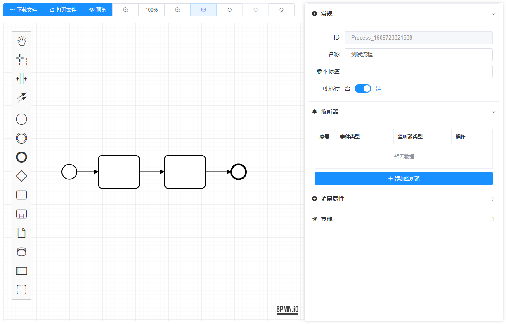

# Bpmn Process Designer

A process designer that depends on [bpmn.js](https://github.com/bpmn-io/bpmn-js)  ,  [Vue 2.x](https://github.com/vuejs/vue) and [ElementUI](https://github.com/ElemeFE/element). 

You can view and edit BPMN 2.0 diagrams in the browser.

在线demo请访问 [MiyueFE Blog](https://miyuesc.github.io/process-designer/)


## Installation

```shell
npm install
// or yarn install
```


## Quick Start

```shell
npm run demo
// or yarn run demo
```




## Documentation


### MyProcessDesigner

#### 1. Attributes

| Attribute             | Description                                               | Type           | Accepted Values                        | Default                                                      |
| --------------------- | --------------------------------------------------------- | -------------- | -------------------------------------- | ------------------------------------------------------------ |
| `value/v-model`       | Initial string                                            | String         | -                                      | -                                                            |
| `translations`        | The translations file                                     | Object         | -                                      | [zh.js](https://github.com/miyuesc/bpmn-process-designer/blob/main/package/process-designer/plugins/translate/zh.js) |
| `additionalModel`     |                                                           | Array / Object | -                                      | -                                                            |
| `moddleExtension`     |                                                           | Object         | -                                      | -                                                            |
| `onlyCustomizeAddi`   | Use only customized extension additional modules          | Boolean        | -                                      | `false`                                                      |
| `onlyCustomizeModdle` | Use only customized extension moddle                      | Boolean        | -                                      | `false`                                                      |
| `processType`         | The prefix of process                                     | String         | `camunda`, `activiti`, `flowable`      | `camunda`                                                    |
| `events`              | Register an event listener for events with the given name | Array          | -                                      | `[element.click]`                                            |
| `headerButtonSize`    | The header buttons' size                                  | String         | `"default", "medium", "small", "mini"` | `small`                                                      |

#### 2. Events

| Event Name      | Description                                                  | Callback Parameters              |
| --------------- | ------------------------------------------------------------ | -------------------------------- |
| `init-finished` | The modeler Instance initialization completed                | `modeler`                        |
| `change`        | When the process changed ( `EventBus.on("commandStack.changed")`) | `XMLString`                      |
| `destroy`       | Before this Vue Component destroy and this bpmnModeler destroyed。 | `modeler`                        |
| `BpmnEvents`    | Like `element.click`, will replace `.` to `-` (`ex: "element.click" => "element-click"` ). If you want to use an event, you must add the event name to the "`events`" parameter | `element, InternalEventInstance` |


