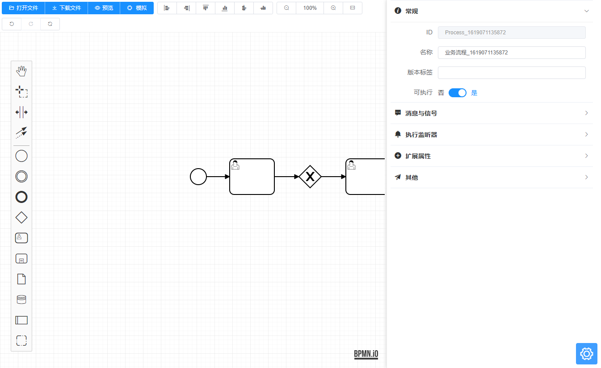
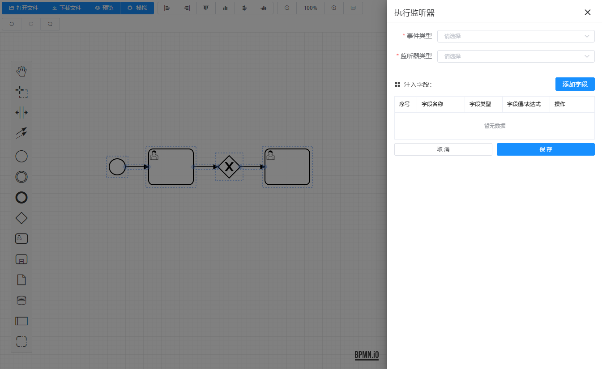
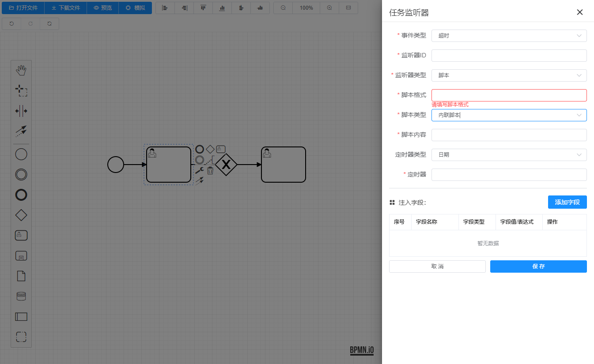
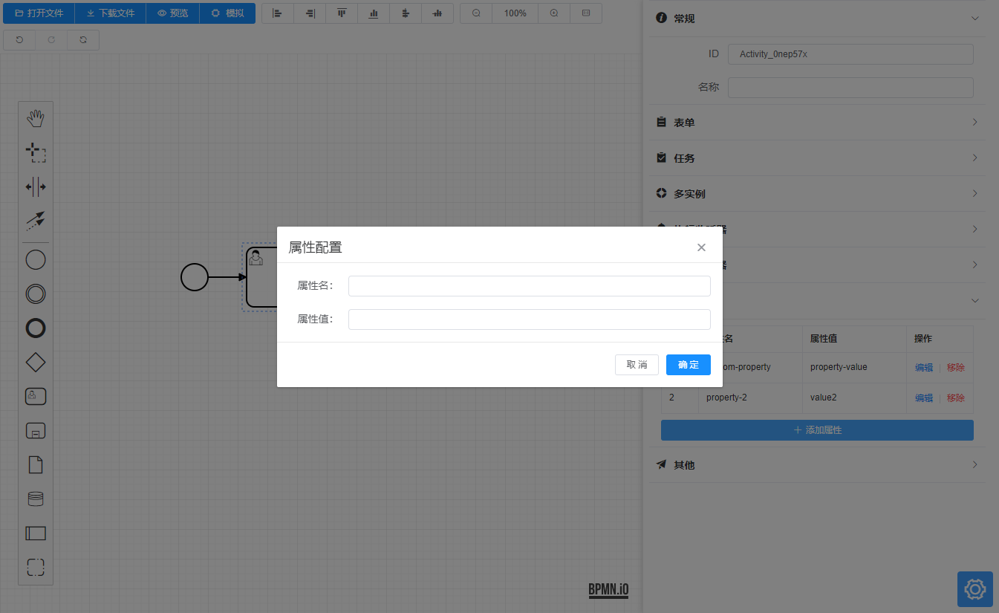
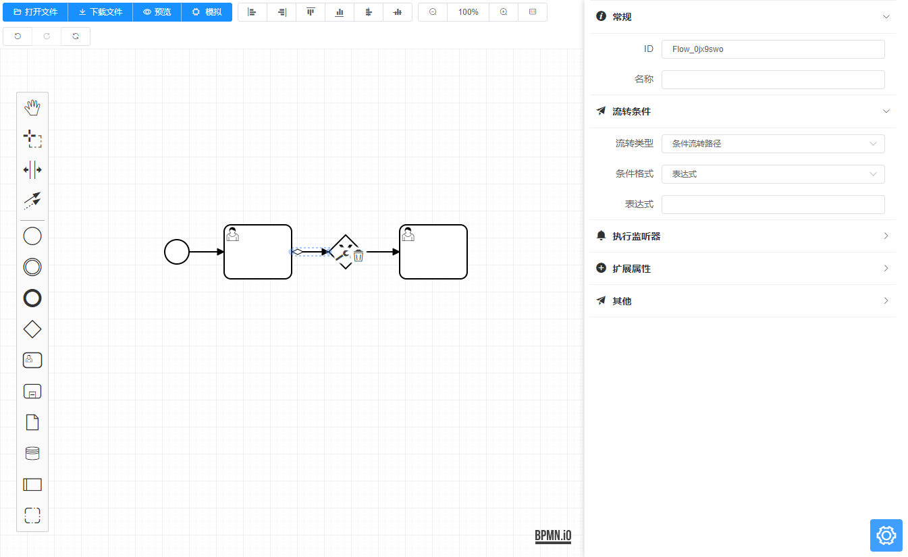
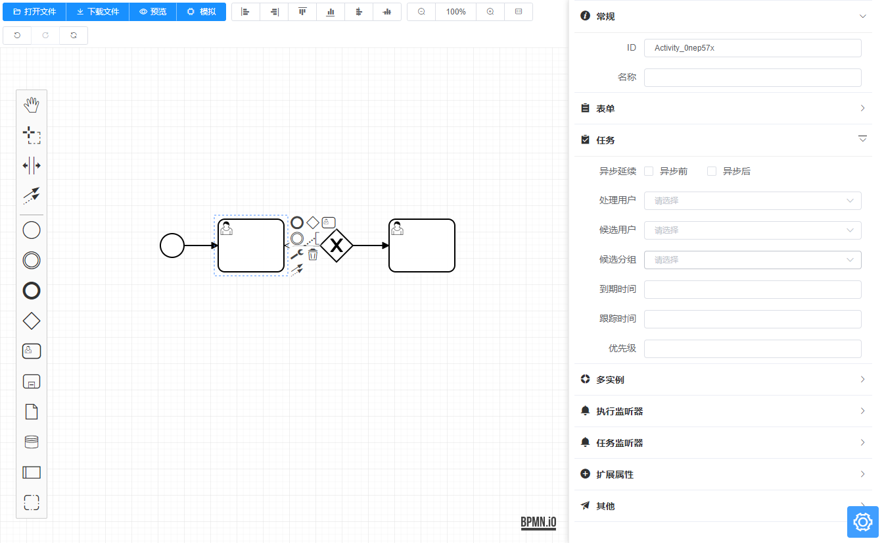
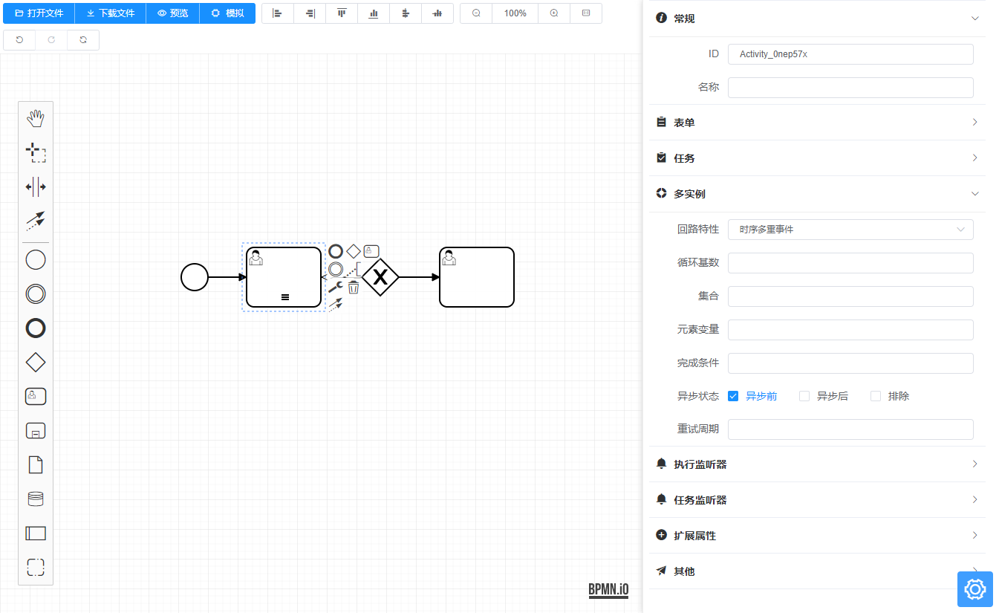
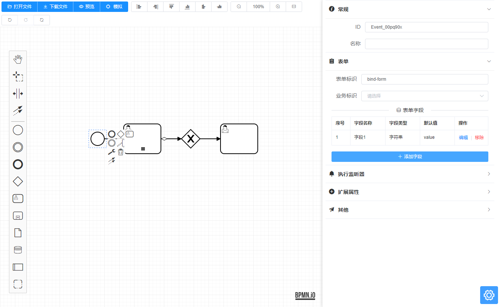
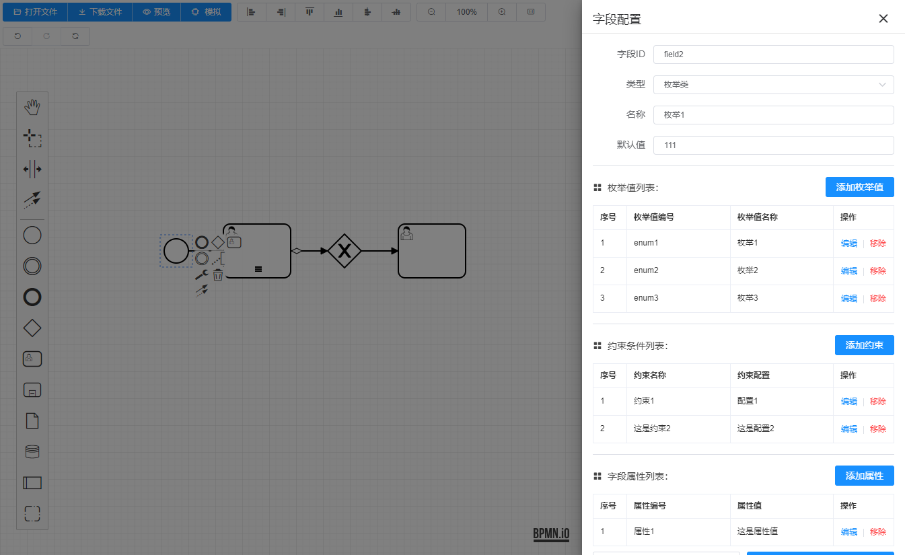
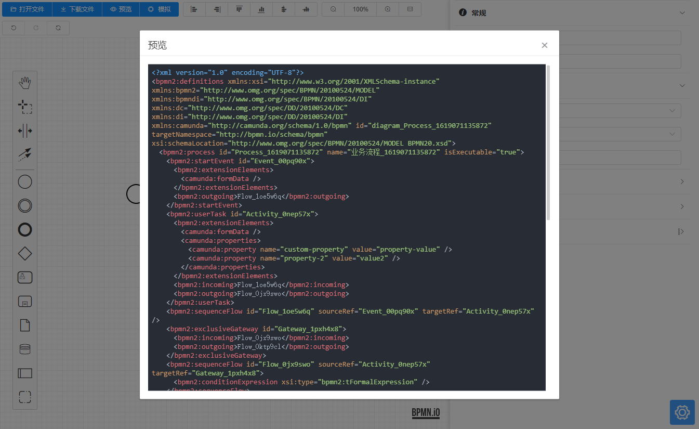

<p align="center">
  <a href="https://github.com/miyuesc/bpmn-process-designer">
   
  </a>
</p>

<h1 align="center">Bpmn Process Designer</h1>

<p align="center">


</p>

<p align="center">


</p>


### 项目简介

一个基于 `bpmn.js`，`Vue 2.x` 和 `ElementUI` 开发的流程设计器。

您可以使用它在浏览器上查看和编辑符合 `BPMN 2.0` 规范的流程文件。

在线demo请访问 [MiyueFE Blog](https://miyuesc.github.io/process-designer/)

码云同步镜像请访问 [Gitee/MiyueSC Process Designer](https://miyuesc.gitee.io/process-designer/)

> 🚀🚀🚀
> 
> **Vite + Vue 3 + pinia + naiveUI 新项目，取消了window命名空间保存bpmn实例的方式，并进行了大部分显示自定义功能，完成了 bpmn.js 基本依赖的 typescript 类型声明。**
>
> **体验请访问：[vite-vue-bpmn-process](https://miyuesc.github.io/vite-vue-bpmn-process/)**
>
> **国内同步体验地址：[vite-vue-bpmn-process](https://miyuesc.gitee.io/vite-vue-bpmn-process/)**
> 
> 付费咨询请加微信（毕竟生活太累了😩😩😩）


### 友情链接

1. Me: [Bpmn.js 中文文档、json描述文件说明等](https://juejin.cn/column/6964382482007490590)
2. Yiuman: 低代码平台 [citrus](https://github.com/Yiuman/citrus) ，已集成 activiti7 工作流引擎后端部分
3. [霖呆呆（掘金五级大佬）](https://juejin.cn/user/360295513463912): [《全网最详bpmn.js教材目录》](https://juejin.cn/post/6844904017567416328)，[关于bpmn.js交流群的说明](https://juejin.cn/post/6844904041026158599)
4. PL-FE: [Bpmn Document](https://github.com/PL-FE/bpmn-doc)
5. 芋道源码: [ruoyi-vue-pro](https://gitee.com/zhijiantianya/ruoyi-vue-pro) ,一套全部开源的企业级的快速开发平台，毫无保留给个人及企业免费使用。
6. 运维咖啡吧: [《BPMN系列原创文章》](https://mp.weixin.qq.com/mp/appmsgalbum?__biz=MzU5MDY1MzcyOQ==&action=getalbum&album_id=1576254888626454529&scene=173&from_msgid=2247484449&from_itemidx=1&count=3&nolastread=1#wechat_redirect)


## 友情赞助

生活不易，偷偷丢个赞赏码吧，各位大佬赏个饭钱🤪🤪🤪🤪~~~~

<p>


</p>


## 1. 安装依赖 Installation

```shell
npm install
// or yarn install
```

## 2. 运行 Quick Start

```shell
npm run demo
// or yarn run demo
```

## 3. 文档说明 Documentation

### 3.1 MyProcessDesigner

#### 3.1.1 Attributes

| Attribute             | Description                                               | Type        | Accepted Values                        | Default                                                      |
| --------------------- | --------------------------------------------------------- | ----------- | -------------------------------------- | ------------------------------------------------------------ |
| `value/v-model`       | 初始化流程对应的 `xml` 字符串                             | String      | -                                      | -                                                            |
| `translations`        | 翻译文件                                                  | Object      | -                                      | [zh.js](https://github.com/miyuesc/bpmn-process-designer/blob/main/package/designer/plugins/translate/zh.js) |
| `additionalModel`     | 自定义的附加模块                                          | Object[] / Object | -                                      | -                                                            |
| `moddleExtension`     | 自定义的扩展模块                                          | Object      | -                                      | -                                                            |
| `onlyCustomizeAddi`   | 仅使用开发时的自定义附加模块 | Boolean     | -                                      | `false`                                                      |
| `onlyCustomizeModdle` | 仅使用开发时的自定义扩展模块        | Boolean     | -                                      | `false`                                                      |
| `prefix`              | 流程引擎对应扩展属性前缀                         | String      | `camunda`, `activiti`, `flowable`      | `camunda`                                                    |
| `events`              | 需要使用的事件列表，可用事件见 [Bpmn.js 中文文档](https://github.com/miyuesc/blog/blob/master/bpmn/docs/Bpmn.js%20document.md#%E4%B8%89-%E4%BA%8B%E4%BB%B6) | Array       | -                                      | `[element.click]`                                            |
| `headerButtonSize`    | 头部按钮组的大小                          | String      | `"default", "medium", "small", "mini"` | `small`                                                      |

#### 3.1.2 Events

| Event Name      | Description                                                  | Callback Parameters              |
| --------------- | ------------------------------------------------------------ | -------------------------------- |
| `init-finished` | 流程实例等初始化完成之后                                     | `modeler`                        |
| `change`        | 流程发生可监听的改变时 ( `EventBus.on("commandStack.changed")`) | `XMLString`                      |
| `destroy`       | 组件准备销毁时，此时流程实例已经销毁                         | `modeler`                        |
| `BpmnEvents`    | Like `element.click`, will replace `.` to `-` (`ex: "element.click" => "element-click"` ). If you want to use an event, you must add the event name to the "`events`" parameter<br />传入参数 `events` 对应的事件发生时触发，会将 `events` 数组内部的事件名称中的 `.` 替换成 `-` 来适配 `vue` 的自定义监听事件。比如 `"element.click"` 会变成 `element-click` | `element, InternalEventInstance` |

#### 3.1.3 Methods

| Method Name             | Parameters                     | Description                              |
| ----------------------- | ------------------------------ | ---------------------------------------- |
| `downloadProcessAsXml`  | `name: string = "diagram"` | 下载文件为 `${name}.xml` 格式的文件  |
| `downloadProcessAsBpmn` | `name: string = "diagram"` | 下载文件为 `${name}.bpmn` 格式的文件 |
| `downloadProcessAsSvg`  | `name: string = "diagram"` | 下载文件为 `${name}.svg` 格式的文件  |
| `processRedo`           | -                              | 恢复上次操作 |
| `processUndo`           | -                              | 撤销本次操作 |
| `processZoomIn`         | `newZoom: number = 0.1`       | 按照指定倍率缩小视图（小数点后两位） |
| `processZoomOut`        | `newZoom: number = 1`         | 按照指定倍率放大视图（小数点后两位） |
| `processZoomTo` | `newZoom: number = 1` | 缩放视图到指定倍率 |
| `processReZoom`         | -                              | 重置缩放倍率并居中显示全部元素 |
| `processRestart`        | -                              | 重置所有编辑过程并清空画布 |
| `createNewDiagram` | `xml: string` | 重新导入新的xml字符串 |

### 3.2 MyProcessPenal

#### 3.2.1 Attributes

| Attribute      | Description                       | Type   | Accepted Values                   | Default   |
| -------------- | --------------------------------- | ------ | --------------------------------- | --------- |
| `bpmn-modeler` | 初始化生成的 `modeler` 实例，必须 | Object | -                                 | -         |
| `prefix`       | 流程引擎对应扩展属性前缀          | String | `camunda`, `activiti`, `flowable` | `camunda` |
| `width`        | 侧边栏宽度                        | Number | -                                 | 480       |


## 4. 功能说明

1. 工具栏：包含常见操作，比如打开文件、下载文件、预览、对齐方式、缩放管理、撤销删除等
2. 常规信息：id、名称、扩展属性、元素文档
3. 特殊节点属性：
   1. 流程全局消息与信号
   2. 执行监听器
   3. 用户任务节点 任务监听器
   4. 表单配置
   5. 任务配置
   6. 多实例任务
   7. 流转条件
4. 内置常用 `camunda` ，`flowable`，`activiti` 解析文件
5. 自定义左侧元素栏 `platte` 与弹出菜单 `contentPad` 示例模块
6. 自定义渲染方法 `renderer` 模块实例


## 5. 运行截图

### 5.1 初始界面



### 5.2 监听器






### 5.3 扩展属性



### 5.4 流转路径配置




### 5.5 任务配置



### 5.6 多实例任务



### 5.8 表单配置





### 5.9 预览




## 学习交流

如果您觉得这些文章对您有帮助，想和我一起学习，欢迎您关注我的微信订阅号。

订阅号名称：前端小白MiyueFE

订阅号：[前端小白MiyueFE](https://images.weserv.nl/?url=https://i0.hdslb.com/bfs/article/fdef0d8f1731ed03b4123d22b7d82acacb6ca10c.jpg)
